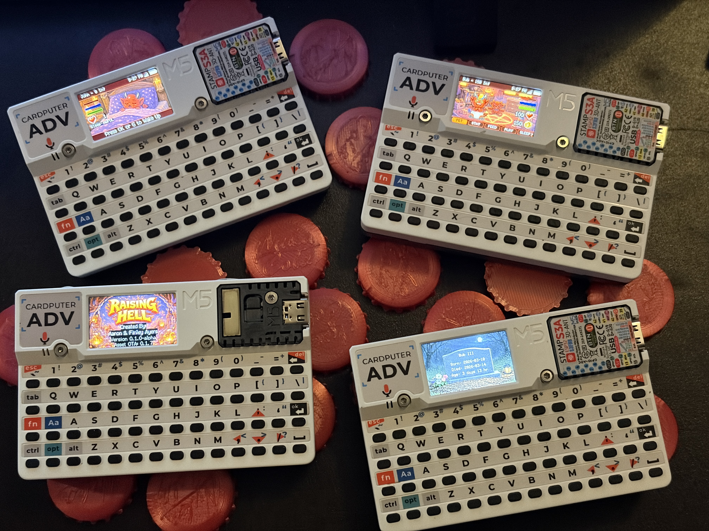

# Raising Hell — Cardputer ADV Edition

A Tamagotchi-style virtual pet game for the M5Stack Cardputer ADV (ESP32).

Raise your infernal companion through multiple life stages, feed it, play mini-games, manage sleep cycles, survive decay, and maybe… resurrect what should not be resurrected.

[](https://discord.gg/RH7dwZqaxV)




## Community

Follow live development, report issues, and help shape Raising Hell:

https://discord.gg/RH7dwZqaxV

------------------------------------------------------------
Hardware Target
------------------------------------------------------------

- M5Stack Cardputer ADV
- ESP32 240 MHz
- SD card required for assets

------------------------------------------------------------
Controls
------------------------------------------------------------

Arrow Keys - Navigate

Enter/G - Confirm

Esc - Menu

Del/Q - Back/Home

GO - Screen Off/On

Shake your Cardputer to wake the screen

Hold GO - Power Menu

/ - Console

Keys Z-M are hotkeys for all tabs

Alternate Navigation - E,A,S,D and O,J,K,L allow one-handed navigation

Some mini-games may use alternate input behavior.

------------------------------------------------------------
Project Structure
------------------------------------------------------------

src/ - Game source files

assets/ - Image files and asset source material

docs/ - Licensing, changelog, contribution notes

tools/ - Asset manifest generator and development tools

------------------------------------------------------------
Installation
------------------------------------------------------------

Raising Hell runs on the M5Stack Cardputer ADV.

There are three main ways to install the game depending on your setup.

---

# 1. Install via M5Launcher Recommended

This is the easiest way to install Raising Hell directly from the Cardputer.

### Steps

1. Install M5Launcher on your Cardputer if it is not already installed.
2. Connect the device to Wi-Fi.
3. Open M5Launcher.
4. Browse the application list and locate Raising Hell.
5. Select the game and choose Install.

After installation:

- Launch the game from the launcher.
- On first boot the game will automatically provision required assets via OTA.

No manual asset downloads are required.

---

# 2. Install using M5Burner

You can install the firmware from a computer using M5Burner.

### Requirements

- M5Burner installed on your computer
- USB connection to the Cardputer ADV

### Steps

1. Connect the Cardputer ADV to your computer via USB.
2. Open M5Burner.
3. Search for Raising Hell.
4. Select the application.
5. Click Burn.
6. Wait for flashing to complete.

After the first launch:

- The game will download required assets automatically via OTA.

---

# 3. Manual Firmware Install Advanced

Advanced users can manually flash the firmware using PlatformIO or esptool.

### Step 1 - Download firmware

Download the latest firmware binary from the GitHub Releases page:

https://github.com/acpayers-alt/raising-hell-cardputer/releases

### Step 2 - Flash firmware

Flash the firmware to the device.

Example using PlatformIO:

pio run -t upload

Example using esptool:

esptool.py --chip esp32s3 --port /dev/ttyACM0 write_flash 0x10000 firmware.bin

### Step 3 - Launch the game

After booting the firmware:

- The game will automatically provision its asset pack via OTA if assets are missing.

---

# Optional Manual Asset Installation Offline Mode

Manual asset installation allows the game to run without Wi-Fi or OTA provisioning.

This is useful for:

- Offline devices
- Faster setup
- Users who prefer to prepare the SD card manually

---

## Important

Raising Hell uses a hybrid asset layout:

- The local asset manifest lives in `/raising_hell/assets/`
- The actual graphics and asset folders live directly under `/raising_hell/`

Do not place the graphics folder inside `/raising_hell/assets/`.

---

## Required SD Card Structure

A correct manual install should look like this:

```text
/raising_hell/
  assets/
    manifest_local.json

  graphics/
    background/
    mini_games/
    pet/
    ui/
```  

The important paths are:

/raising_hell/assets/manifest_local.json
/raising_hell/graphics/

---

## Incorrect Structures

These will not work correctly:

/raising_hell/assets/graphics/

/raising_hell/assets/assets/raising_hell/graphics/

/raising_hell/assets/raising_hell/graphics/

If the manifest is detected but the graphics are in the wrong place, the game may boot without visible graphics.

---

## Manual Asset Install Steps

1. Download the latest asset pack zip from GitHub Releases:

https://github.com/acpayers-alt/raising-hell-cardputer/releases

2. Extract the zip on your computer.

3. Copy the asset pack contents to the SD card so the final layout is:

/raising_hell/assets/manifest_local.json

/raising_hell/graphics/

4. If the manifest is not already named `manifest_local.json`, rename it to:

manifest_local.json

5. Confirm the final manifest path is:

/raising_hell/assets/manifest_local.json

6. Safely eject the SD card.

7. Insert the SD card into the Cardputer ADV.

8. Boot Raising Hell.

---

## First Boot With Manual Assets

If the manual asset install is valid:

- The game will detect the local asset manifest.
- The game will verify required graphics canary files.
- Wi-Fi can be skipped.
- You will be prompted to set the date, time, and timezone manually.
- The game will continue without downloading assets.

A successful boot log should include something like:

[BOOT][ASSET] assetsPresent=1 tooOld=0

---

## Manual Install Troubleshooting

If the game asks for Wi-Fi or tries OTA anyway:

- Confirm the SD card is FAT32.
- Confirm the manifest is exactly here:

/raising_hell/assets/manifest_local.json

- Confirm graphics are directly here:

/raising_hell/graphics/

- Confirm graphics are not nested under `/raising_hell/assets/`.
- Confirm you are using the correct asset pack version for the firmware.
- Confirm the asset pack is complete.

If the game boots but graphics are missing, the most likely cause is an incorrect folder layout.

---

# First Boot Behavior

On first launch Raising Hell will:

- Check for required game assets
- Use local SD assets if present and valid
- Download missing or outdated assets automatically if Wi-Fi is available
- Store assets on the SD card
- Guide first-time users through setup

This process normally only occurs once.

---

# Hardware Support

Currently supported hardware:

M5Stack Cardputer ADV

The original first-generation Cardputer has not been tested and may not work correctly.

---

# Troubleshooting

If the game fails to start:

- Ensure an SD card is installed.
- Ensure the SD card is FAT32.
- Ensure assets are installed or Wi-Fi is available for OTA provisioning.
- Restart the device after flashing.
- If manually installing assets, verify the folder structure carefully.

------------------------------------------------------------
Development Direction
------------------------------------------------------------

This project is under active architectural cleanup and refactor toward:

- Modular state architecture
- Strict include hygiene
- Removal of legacy globals
- Separation of platform and gameplay logic
- Open-source readiness

------------------------------------------------------------
Arduino IDE Settings
------------------------------------------------------------

Recommended configuration:

Board: M5Cardputer

Flash Mode: QIO 80MHz

Flash Size: 4MB 32Mb

Partition Scheme: Huge APP 3MB No OTA / 1MB SPIFFS

CPU Frequency: 240MHz WiFi

Upload Speed: 921600

------------------------------------------------------------
Building From Source
------------------------------------------------------------

1. Clone the repository.
2. Copy the required assets to an SD card.
3. Open raising_hell_cpADV.ino in the Arduino IDE.
4. Select the board settings listed above.
5. Compile and upload.

For PlatformIO builds, use the provided PlatformIO configuration.

------------------------------------------------------------
Known Limitations
------------------------------------------------------------

- Requires SD card
- Designed specifically for Cardputer ADV hardware
- Not optimized for alternate ESP32 boards

------------------------------------------------------------
License
------------------------------------------------------------

Code is licensed under the MIT License.
See the LICENSE file for details.

Assets licensing is described in ASSETS_LICENSE.md.

------------------------------------------------------------
Author
------------------------------------------------------------

Aaron Ayers

If you build this, fork it, improve it, or port it — I’d love to see it.

------------------------------------------------------------
Screenshots
------------------------------------------------------------


